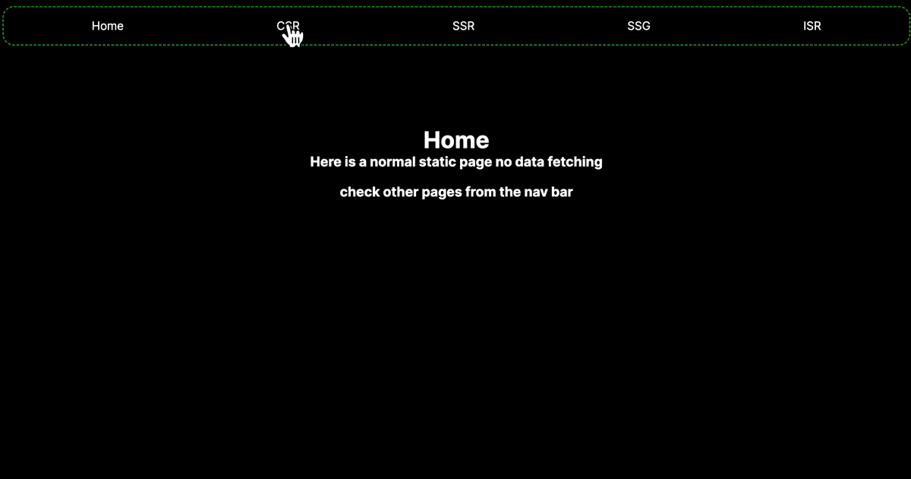

**This** is a demo for different rendering modes , done for [Jeddah tech meetup](https://jeddahmeetup.tech/) bootstrapped with [`create-next-app`](https://github.com/vercel/next.js/tree/canary/packages/create-next-app).

## Getting Started

First, create a project on [Supbase](https://supabase.com)
with db scehma 

```sql
    id: number;
    created_at: string;
    name: string;
    type: string;
    hp: number;
    image: string;
```
then add some lovely pokemons 

do not forget to update `.env` with the secrets 

`NEXT_PUBLIC_SUPABASE_URL`
`NEXT_PUBLIC_SUPABASE_KEY` 


```bash
npm run dev
# or
yarn dev
```

Open [http://localhost:3000](http://localhost:3000) with your browser to see the result.



